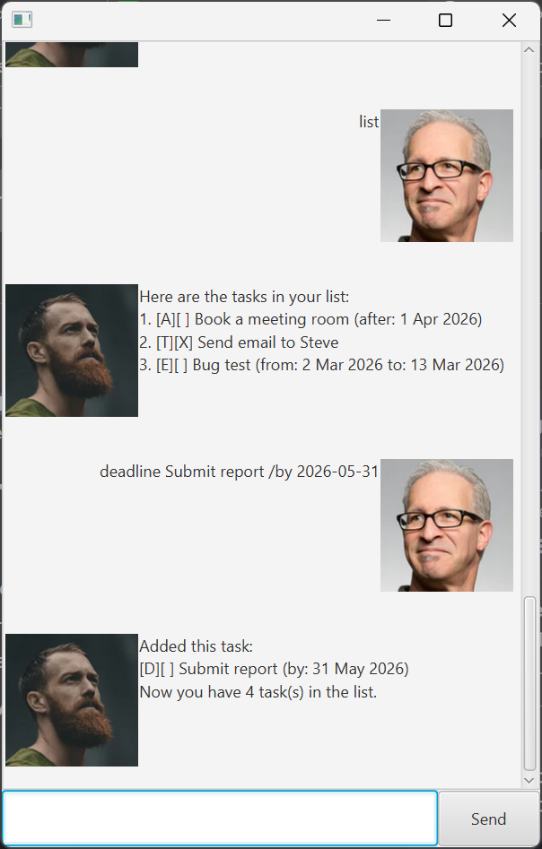

# Bobby User Guide



Bobby the Bot is a desktop application for task management. It uses a command-line interface while taking on the appearance of a chatbot.

## Command Format

- The command name is the first word of the input command. It should be entered in lowercase.


- Parameter names are prefixed by a forward slash `/` and should be entered in lowercase.  
e.g., `/from` and `/to` are parameters for the `event` command.


- Items in angle brackets `< >` are parameter values that need to be provided by the user.  
e.g., the command `todo <description>` can be used as `todo Read book`.


- Items in square brackets `[ ]` are optional parameters.


- Parameters can be in any order.  
e.g., if the command specifies `/from <date> /to <date>`, `/to <date> /from <date>` is also valid.


- Extraneous parameters will be ignored.

## Adding 'todo' tasks

'Todo' tasks are simple tasks with only a description. They do not have a specific date associated with them.

**Format:** `todo <description> [/done]`

**Example:** `todo Read book`

**Expected Output:**

```
Added this task:
[T][ ] Read book
Now you have 1 task(s) in the list.
```

> [!TIP]
> You can add a 'todo' task that is already done by including the optional `/done` parameter: `todo Read book /done`.
> If you wish to edit the locally stored data file directly, you can append `/done` to the end of a task entry to mark it as done. Refer to [Editing the data file](#editing-the-data-file).

## Adding 'deadline' tasks

'Deadline' tasks have a description and a deadline stored as a date.

**Format:** `deadline <description> /by <date: YYYY-MM-DD> [/done]`

**Example:** `deadline Submit report /by 2026-06-30`

**Expected Output:**

```
Added this task:
[D][ ] Submit report (by: 30 Jun 2026)
Now you have 2 task(s) in the list.
```

## Adding 'event' tasks

'Event' tasks have a start and end date.

**Format:** `event <description> /from <date: YYYY-MM-DD> /to <date: YYYY-MM-DD> [/done]`

**Example:** `event Holiday /from 2026-12-20 /to 2027-01-10`

**Expected Output:**

```
Added this task:
[E][ ] Holiday (from: 20 Dec 2026 to: 10 Jan 2027)
Now you have 3 task(s) in the list.
```

## Adding 'do-after' tasks

'Do-after' tasks need to be done after a specified date.

**Format:** `doafter <description> /after <date: YYYY-MM-DD> [/done]`

**Example:** `doafter Start project /after 2026-02-03 /done`

**Expected Output:**

```
Added this task:
[A][X] Start project (after: 3 Feb 2026)
Now you have 4 task(s) in the list.
```

## List all tasks

Added tasks are stored in order of addition. You can view the list of all tasks.

**Format:** `list`

**Expected Output:**

```
Here are the tasks in your list:
1. [T][ ] Read book
2. [D][ ] Submit report (by: 30 Jun 2026)
3. [E][ ] Holiday (from: 20 Dec 2026 to: 10 Jan 2027)
4. [A][X] Start project (after: 3 Feb 2026)
```

## Marking tasks as done

**Format:** `mark <task number>`

**Example:** `mark 2`

**Expected Output:**

```
Marked this task as done:
[D][X] Submit report (by: 30 Jun 2026)
```

> [!TIP]
> Use the `list` command to find the task number of the task you want to mark as done.

## Unmarking tasks

Use this to mark a task as not done.

**Format:** `unmark <task number>`

**Example:** `unmark 2`

**Expected Output:**

```
Marked this task as not done:
[D][ ] Submit report (by: 30 Jun 2026)
```

## Deleting tasks

**Format:** `delete <task number>`

**Example:** `delete 3`

**Expected Output:**

```
Deleted this task:
[E][ ] Holiday (from: 20 Dec 2026 to: 10 Jan 2027)
Now you have 3 task(s) in the list.
```

## Finding tasks

You can search for tasks that contain specific text in their description. This search is case-insensitive.

**Format:** `find <text>`

**Example:** `find read`

**Expected Output:**

```
Here are the matching tasks in your list:
1. [T][ ] Read book
```

## Exiting the application

**Format:** `bye`

Alternatively, you can also click the close button on the application window to exit.

## Saving data

Upon exiting the application, your tasks are automatically saved to a local file named `tasks.txt` in the same directory as `bobby.jar`.

## Editing the data file

Users can directly edit the `tasks.txt` file to modify their tasks.

Each task is described on its own line, using the same format as the command used to create it.

> [!CAUTION]
> If the format of the data file is incorrect after editing, Bobby the bot will discard the data file and start with an empty task list upon launch. It is recommended to make a backup of the data file before making any edits.